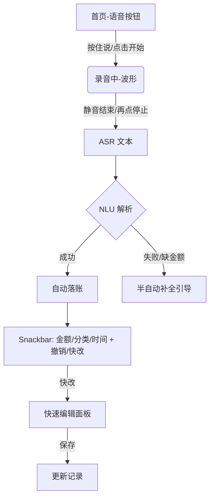

我想开发一个语音记账的app，主要手动记账太慢，语音记账现有产品确认环节繁琐、容错差，打造极致快的“语音→落账”通道的记账 app，现在需要输出高保真的原型图，请通过以下方式帮我完成所有界面的原型设计，并确保这些原型界面可以直接用于开发：
1、用户体验分析：先分析这个 App 的主要功能和用户需求（需求可以详细见下面需求章节），确定核心交互逻辑。 
2、产品界面规划：作为产品经理，定义关键界面，确保信息架构合理。
3、高保真 UI 设计：作为 UI 设计师，设计贴近真实 iOS/Android 设计规范的界面，使用现代化的 UI 元素，使其具有良好的视觉体验。
4、HTML 原型实现：使用 HTML + Tailwind CSS（或 Bootstrap）生成所有原型界面，并使用 FontAwesome（或其他开源 UI 组件）让界面更加精美、接近真实的 App 设计。拆分代码文件，保持结构清晰：
5、每个界面应作为独立的 HTML 文件存放，例如 home.html、profile.html、settings.html 等。
- index.html 作为主入口，不直接写入所有界面的 HTML 代码，而是使用 iframe 的方式嵌入这些 HTML 片段，并将所有页面直接平铺展示在 index 页面中，而不是跳转链接。
- 真实感增强：  
    - 界面尺寸应模拟 iPhone 15 Pro，并让界面圆角化，使其更像真实的手机界面。  
    - 使用真实的 UI 图片，而非占位符图片（可从 Unsplash、Pexels、Apple 官方 UI 资源中选择）。  
    - 添加顶部状态栏（模拟 iOS 状态栏），并包含 App 导航栏（类似 iOS 底部 Tab Bar）。

请按照以上要求生成完整的 HTML 代码，并确保其可用于实际开发。

# 需求

## 0. 背景与产品定位

- **痛点**：手动记账太慢，语音记账现有产品确认环节繁琐、容错差。
- **定位**：极致快的“语音→落账”通道；默认**自动保存**，提供“撤销/快改”。
- **成功标准（首版）**：
  - 语音→落账 **P50 ≤ 2.5s、P90 ≤ 5s**。
  - **一次通过率 ≥ 85%**（金额、分类、时间三要素全部正确）。
  - 7 日留存 ≥ 30%。

---

## 1. MVP 范围（Scope）

### In

1. **语音输入**：按住说/点击开始；静音自动结束；权限引导。
2. **ASR 识别**：中文普通话（首版）；本地或在线引擎（实现可替换）。
3. **语义解析（NLU）**：抽取金额、分类、时间、账户、商户/备注、币种。
4. **自动落账**：无二次弹窗确认；底部 Snackbar 显示结果并提供“撤销/快改”。
5. **快改**：在结果条点击“金额/分类/时间”进入**轻量改动面板**。
6. **账单列表**：最近记录（按时间倒序），支持搜索（金额/分类/商户/备注）。
7. **设置**：自动保存开关、默认账户、默认账本、分类管理（只增删改名）。
8. **导出**：CSV（本地分享）。

### Out（延后到 V2）

- OCR 小票识别；家庭账本与分摊；多币种自动汇率；Watch/小组件；订阅账单；语音问答。

---

## 2. 主要用户故事（User Stories）

1. 作为用户，我按住说：“**餐饮三十五今天中午咖啡**”，系统在 3 秒内**自动记账**并提示“已记 ¥35 餐饮-咖啡 · 今天 12:05”，我可**点撤销**或**快改**。
2. 作为用户，我说：“**昨天晚上滴滴一百二**”，系统解析为【交通-打车 | ¥120 | 昨日 22:00 | 账户：默认】，**无需确认**直接保存。
3. 作为用户，我说不清楚（如“买了些菜”），系统提示“未识别到金额”，**转为键入金额**的半自动流程。
4. 作为用户，我希望默认记在上次分类/账户，除非我明确说出新分类/账户。

---

## 3. 信息架构 & 导航

- **首页 = 快速记一笔**（语音主入口 + 最近一条记录卡片）。
- **账单**（列表、搜索、详情/快改）。
- **设置**（自动保存、默认账户、账本、分类管理、导出 CSV、隐私）。

---

## 4. 低保真原型（Wireframe 文字稿）

> 注：供原型设计师/前端快速搭框。视觉走简洁风，主色 #4A6CF7（示意）。

### 4.1 首页（快速记一笔）

- 顶部：当日已记 × 笔 | 本月合计 ¥×××（次要）
- 中部：**圆形语音按钮**（长按=说话；点击=开始/停止），波形动画。
- 底部：最近一条记录卡片（金额大字、分类/时间/账户）；**Snackbar** 位于底部：
  - 文案：`已记 ¥35 · 餐饮-咖啡 · 今天 12:05`
  - 操作：`撤销` | `快改`

### 4.2 账单列表

- 搜索框（占位：金额/分类/备注/商户）。
- 列表项：金额（右）、分类-子类、商户/备注、时间、账户。
- 滑动操作：左滑删除（带撤销）；右滑快改（金额/分类/时间）。

### 4.3 快速编辑面板（Bottom Sheet）

- 三个 Tab：金额｜分类｜时间；默认落在**最可能出错**的项（由置信度排序）。
- 金额：数字键盘 + 元/角分自动格式化。
- 分类：常用置顶 + 搜索。
- 时间：快速选项（今天/昨天/前天/自定义日期时间）。

### 4.4 设置

- 自动保存（开/关，默认**开**）。
- 默认账户（下拉）。
- 默认账本（下拉）。
- 分类管理（新增/改名/删除，限制两级）。
- 导出 CSV（时间范围选择器）。
- 隐私与权限说明（麦克风、本地存储）。
